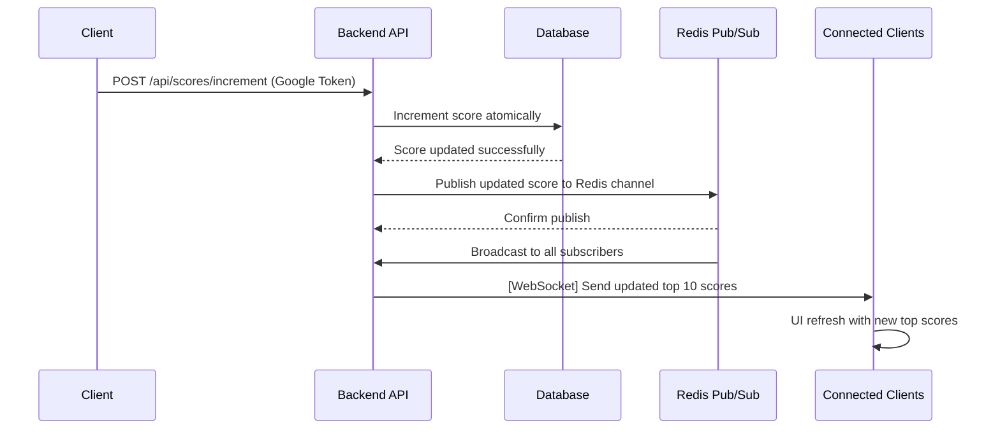

# Scoreboard Module Specification  

This document provides the specification for implementing the **Scoreboard Module** on the backend application server. It includes the module’s purpose, system architecture, detailed API design, execution flow, and recommended improvements.  

---

## 1. Overview  

The **Scoreboard Module** is responsible for:  
- Storing and managing user scores.  
- Displaying the top 10 user scores on a real-time scoreboard.  
- Allowing authenticated users to increment their scores by performing a specific action.  
- Preventing unauthorized or automated (“bot”) score increments.  

### Key Objectives  
1. Display a **Top 10 Scoreboard** that updates live on the client UI.  
2. Ensure only legitimate, authenticated users can increment their scores.  
3. Mitigate automated actions (e.g., bot clicks) to maintain score integrity.  

---

## 2. System Architecture  

The Scoreboard Module includes the following components:  
- **Frontend (Client UI)**:  
  - Displays the live scoreboard.  
  - Allows users to perform an action that increments their score.  
  - Communicates with the backend via RESTful API and WebSocket.  
- **Backend (API Server)**:  
  - Manages user authentication via **Google OAuth**.  
  - Handles score increments and updates the database.  
  - Broadcasts real-time updates using **WebSocket**.  
- **Database**: Stores user profiles and scores.  
- **Redis Pub/Sub**: Ensures real-time updates are consistently broadcasted across multiple server instances.  
- **Google OAuth Service**: Authenticates users and verifies token validity.  

---

## 3. Authentication & Security  

- **Google Sign-In**: Users must log in using Google OAuth to obtain a valid token (ID token).  
- **Token Verification**:  
  - Each request to increment a score must include a valid token.  
  - The backend verifies this token with Google’s endpoint or by validating the signed JWT.  
- **Rate Limiting**:  
  - To prevent spam or auto-clicks, a rate limit of **1 increment per second per user** is enforced.  
- **Anti-bot Measures** (Optional): Integrate **reCAPTCHA** or other anti-bot mechanisms if unusual activity is detected.  

---

## 4. API Endpoints  

### 4.1 `POST /api/scores/increment`  
- **Purpose**: Increment the authenticated user’s score by 1.  
- **Headers**:  
  - `Authorization: Bearer <google_id_token>`  
- **Request Body**:  
  ```json
  {}
  ```
- **Response**:  
  - **HTTP 200** on success:  
    ```json
    {
      "message": "Score incremented successfully",
      "newScore": <number>
    }
    ```
  - **HTTP 401** if the token is invalid or expired.  
  - **HTTP 429** if rate-limited.  

### 4.2 `GET /api/scores/top10`  
- **Purpose**: Retrieve the top 10 user scores in descending order.  
- **Headers**: *(None required unless visibility is restricted to logged-in users)*  
- **Response**:  
  ```json
  [
    {
      "userId": "abc123",
      "displayName": "John Doe",
      "score": 42
    },
    ...
  ]
  ```  

### 4.3 Real-Time Updates (`WebSocket`)  
- **URI**: `ws://<server>/scoreboard`  
- **Flow**:  
  - Clients establish a persistent WebSocket connection.  
  - When a score changes, the server broadcasts the updated top 10 list to all connected clients.  
  - Clients receive the update and refresh their UI instantly.  

---

## 5. Real-Time Update Strategy  

### Chosen Solution: WebSocket with Redis Pub/Sub  
This approach provides low-latency, bi-directional communication and ensures consistent broadcasting across distributed server instances.  

### How It Works  
1. **WebSocket Connection**:  
   - Clients connect to the WebSocket server for real-time updates.  
   - Connections are managed in memory for efficient broadcasting.  

2. **Score Increment Flow**:  
   - User sends a request to increment their score.  
   - Server verifies the Google OAuth token.  
   - The server increments the user’s score atomically in the database.  
   - After updating the score, the server publishes a message to a Redis channel.  

3. **Broadcasting Updates with Redis Pub/Sub**:  
   - All application instances subscribe to the Redis channel `scoreboard_updates`.  
   - When a new message is published, all instances receive the event.  
   - Each instance broadcasts the updated top 10 scores to its connected WebSocket clients.  

### Why WebSocket with Redis Pub/Sub?  
- **Low Latency**: Ensures users see score updates instantly.  
- **Scalability**: Redis allows multiple server instances to share the same update stream.  
- **Concurrency Handling**: Redis maintains message order, preventing race conditions.  

---

## 6. Data Model  

**User Table**  
- `id` (string or UUID)  
- `email` (string, unique)  
- `displayName` (string)  
- `score` (integer, default 0)  

**Redis Sorted Set (for Top 10)**  
- Key: `leaderboard`  
- Members: `userId`  
- Score: `score`  
- Sorted in descending order for fast retrieval of the top 10 users.  

---

## 7. Execution Flow Diagram  



---

## 8. Concurrency and Data Consistency  

### Atomic Operations and Transactional Updates  
- **Atomic Increments**: Ensure each increment is processed sequentially at the database level.  
- **Consistency**:  
  - Redis Pub/Sub maintains message order.  
  - Include a **timestamp** in each update message to order updates on the client side.  

### Example in Redis (Atomic Increment)  
```js
// Increment score atomically in Redis
redisClient.hincrby('user_scores', userId, 1, (err, newScore) => {
    if (err) throw err;
    redisClient.publish('scoreboard_updates', JSON.stringify({ userId, newScore }));
});
```

---

## 9. Improvements and Recommendations  

1. **Security Enhancements**:  
   - Implement **reCAPTCHA** if suspicious behavior is detected.  
   - Use HTTPS for secure communication.  

2. **Performance & Scalability**:  
   - Deploy multiple WebSocket servers for high traffic.  
   - Store the top 10 list in Redis for fast retrieval.  

3. **Anti-bot Measures**:  
   - Apply rate limiting (e.g., 1 increment per second per user).  
   - Use **User-Agent** checks and IP tracking for anomaly detection.  

4. **Edge Cases**:  
   - Handle ties in top 10 by sorting by timestamp or user ID as a tiebreaker.  
   - Ensure consistent ordering using Redis Sorted Sets.  

---

## 10. Summary  

This Scoreboard Module:  
- Authenticates users with **Google OAuth**.  
- Updates the scoreboard in real time using **WebSocket with Redis Pub/Sub**.  
- Maintains data integrity and consistency with atomic operations and timestamp ordering.  
- Prevents unauthorized actions through **rate limiting** and **token validation**.  

---

## 11. Example and Justification  

This Golang implementation demonstrates how to build the Scoreboard Module with:  
- **Real-Time Updates** using WebSocket with Redis Pub/Sub.  
- **Atomic Score Increments** ensuring data consistency.  
- **Scalable Architecture** suitable for high-traffic applications.  

Alright! Let's update the documentation to include how to test **Real-Time Updates** using **Websocat** as shown in the screenshot.  

---

## 12. How to Use and Test  

### 12.1 Starting the Server  
1. Ensure Redis is running (use Docker if needed):  
    ```sh
    docker run --name redis -p 6379:6379 -d redis
    ```
2. Start the Golang server:  
    ```sh
    go run main.go
    ```

---

### 12.2 Test API Endpoints  
- **Increment Score**:  
    ```sh
    curl -X POST http://localhost:8080/api/scores/increment \
    -H "Content-Type: application/json" \
    -d '{"userId": "test_user_123", "displayName": "Test User"}'
    ```
- **Get Top 10 Scores**:  
    ```sh
    curl http://localhost:8080/api/scores/top10
    ```

---

### 12.3 Test Real-Time Updates Using Websocat  

1. **Open a WebSocket Connection**:  
    In one terminal, start Websocat:  
    ```sh
    websocat ws://localhost:8080/api/scores/ws
    ```
    You should see the connection established and a blinking cursor.

2. **Trigger a Score Update**:  
    In another terminal, increment the score using the **Increment Score** curl command:  
    ```sh
    curl -X POST http://localhost:8080/api/scores/increment \
    -H "Content-Type: application/json" \
    -d '{"userId": "test_user_123", "displayName": "Test User"}'
    ```

3. **Observe Real-Time Update**:  
    In the Websocat terminal, you should see the live update immediately, like this:  
    ```json
    {"id":"test_user_123","displayName":"Test User","score":3}
    {"id":"test_user_123","displayName":"Test User","score":4}
    ```

4. **Repeat and Verify**:  
    - Run the curl command multiple times.  
    - Each increment should appear in real-time in the Websocat window, showing the updated score.  
